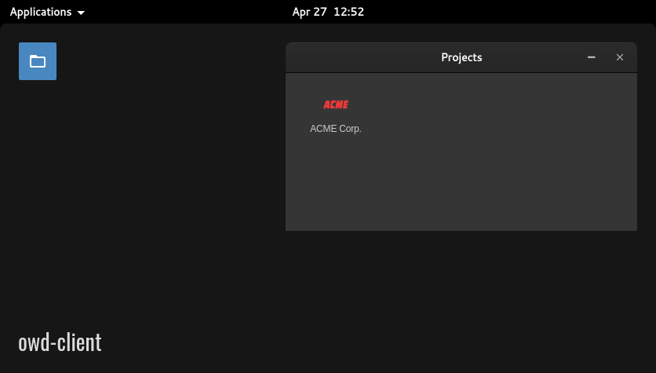

# Projects module for OWD Client
> The perfect module to show your portfolio in a folder-like way

<p>
    
</p>

<p>
    <a href="LICENSE"></a>
    <a href="https://github.com/owdproject/owd-client"></a>
    <a href="https://github.com/topics/owd-modules"></a>
    <a href="https://hacklover.net/patreon"></a>
    <a href="https://hacklover.net/discord"></a>
</p>

## Demo
[Try it out](https://hacklover.net/client), just open the terminal and type "projects"

## Features
- Show projects in a folder
- Open project link in a new tab
- Open project link in an iframe window (optional)

## Quick install
- Move to your client folder, then
  ```
  # Install this module with Npm
  npm install hacklover/owd-app-projects
  
  # Or using Yarn
  yarn add hacklover/owd-app-projects
  ```
- Define this module in `owd-client/client.extensions.ts`
  ```js
  import AboutModule from "@owd-client/core/src/modules/app/about";
  import DebugModule from "@owd-client/core/src/modules/app/debug";
  import ProjectsModule from "hacklover/owd-app-projects/client";

  export default {
    app: {
      modules: [
        AboutModule,
        DebugModule,
        ProjectsModule,
      ]
    },
    ...
  ```
- Copy the content of the [client/config](https://github.com/hacklover/owd-app-projects/tree/master/client/config) folder into `owd-client/config`

## Configuration
#### Add new projects
Edit the `config/projects/config.json` file that you copied during the installation by adding all the projects you want.

#### Show projects in an iframe
Add to the project configuration the "window" property to define the window name to open (for example `WindowProjectACME`) when you click on it.
It must correspond to an existing window that uses the <WindowIframe> component.  

An example of an iframe window is available in this module (WindowProjectACME.vue).
```json
"example": {
  "title": "ACME",
  "name": "ACME",
  "url": "https://acme.gov",
  "target": "_blank",
  "window": "WindowProjectACME",
  "icon": "data:image/png;base64,iVB...",
  "year": "1988",
  "end": 0,
  "comingSoon": false,
  "inactive": false,
  "hidden": false
}
```

## Compatibility
- Open Web Desktop client v2.0.0-beta.1

## License
This project is released under the [MIT License](LICENSE)